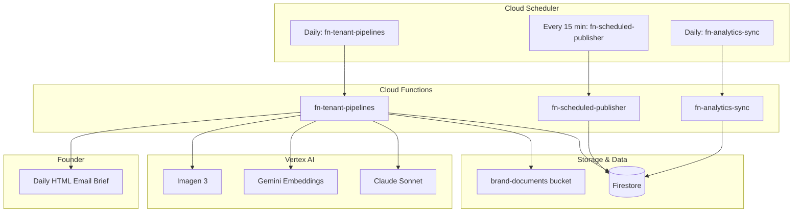

# AI Marketing Toolkit — Intonation Labs

AI-powered marketing and client acquisition toolkit for Intonation Labs. The current codebase supports a multi-tenant daily pipeline, dashboard-based draft scheduling, scheduled publishing workers, and analytics sync workers. External social publishing and analytics providers are still mock-backed until platform OAuth and provider integrations are connected.

## Architecture



## Tech Stack

| Layer | Technology |
|-------|------------|
| Backend | Python 3.12, Cloud Functions (2nd gen), Functions Framework |
| Database | Firestore |
| Storage | Cloud Storage (brand documents) |
| Email | SMTP |
| AI | Vertex AI (Claude Sonnet, Gemini embeddings, Imagen 3) |
| IaC | Terraform |
| CI/CD | GitHub Actions |

## Quick Start

### Prerequisites

- GCP project with billing enabled
- Python 3.12+
- Node.js 20+ and npm (for `frontend/`; CI and `Makefile` use `npm ci` / `npm install`)
- Terraform 1.5+
- gcloud CLI
- SMTP credentials for the daily brief

### 1. Clone and configure

```bash
git clone <repo-url>
cd auto_marketing
cp .env.example .env
# Edit .env with your GCP project ID, region, and API keys
```

### 2. Provision baseline infrastructure

```bash
cd infra
cp terraform.tfvars.example terraform.tfvars
# Edit terraform.tfvars for your project and region
terraform init
terraform plan -var-file=terraform.tfvars
terraform apply -var-file=terraform.tfvars
```

### 3. Deploy the multi-tenant pipeline function

```bash
make deploy-pipeline
```

The deploy target is controlled by `PROJECT_ID` in `Makefile`. The command deploys:

- `fn-tenant-pipelines`
- `fn-scheduled-publisher`
- `fn-analytics-sync`

All three are authenticated-only HTTP Cloud Functions.

### 4. Deploy the FastAPI API

```bash
make deploy-api APP_URL="https://YOUR_APP_HOSTING_DOMAIN"
```

This deploys the FastAPI service to Cloud Run using `functions/Dockerfile`.

### 5. Add the function URL to Terraform

After `make deploy-pipeline`, update `infra/terraform.tfvars`:

```hcl
function_urls = {
  "fn-daily-pipeline"      = "https://<legacy-url>"
  "fn-tenant-pipelines"    = "https://<deployed-url>"
  "fn-scheduled-publisher" = "https://<deployed-url>"
  "fn-analytics-sync"      = "https://<deployed-url>"
}
```

Then re-run:

```bash
make infra-apply
```

### 6. Deploy the Next.js frontend to Firebase App Hosting

Create an App Hosting backend once:

```bash
firebase init apphosting
```

Use:
- backend ID: `automark-web`
- app root: `frontend`

Then deploy:

```bash
make deploy-frontend
```

### 7. Upload brand documents

Upload PDFs, docs, or text files to the `brand-documents-<project-id>` bucket. The current codebase includes chunking, embeddings, and retrieval helpers for RAG, but document ingestion is not yet automated in the deployed path.

## Directory Structure

```
auto_marketing/
├── functions/          # Python Cloud Function source
├── infra/              # Terraform modules
├── .github/workflows/  # CI/CD pipelines
├── Makefile            # Local dev and deploy commands
└── .env.example        # Environment variable template
```

## Environment Variables

See `.env.example` for the full reference. Key variables:

- `GCP_PROJECT_ID`, `GCP_REGION` — GCP project and region
- `BRAND_DOCS_BUCKET` — Cloud Storage bucket name
- `APP_URL` — public frontend URL used for Stripe billing return links
- `STRIPE_*_PRICE_ID` — Stripe product price IDs for Starter and Pro (`STRIPE_PRO_PRICE_ID` must match the Pro price embedded in your Stripe Pricing Table)
- `NEXT_PUBLIC_STRIPE_PUBLISHABLE_KEY`, `NEXT_PUBLIC_STRIPE_PRICING_TABLE_ID` — frontend embed for Settings → Billing (set in `.env` / App Hosting / GitHub Actions build secrets)
- **Stripe webhooks:** endpoint URL `https://<your-api-host>/webhooks/stripe` (alias of `POST /billing/webhook`). Use the endpoint signing secret as `STRIPE_WEBHOOK_SECRET`.
- **Stripe Dashboard (Pricing table):** success URL `{APP_URL}/billing?checkout=success`, cancel URL `{APP_URL}/billing?checkout=canceled` (resolves to Settings → Billing with the same polling UX)
- `EMBEDDING_MODEL` — Vertex AI embedding model ID
- `SMTP_*` — SMTP configuration for the daily email brief

## Scheduled Operation

| Automatic (Cloud Scheduler) | Manual (Founder) |
|----------------------------|------------------|
| Run `fn-tenant-pipelines` at 07:00 SGT | Review generated drafts in the dashboard |
| Run `fn-scheduled-publisher` every 15 minutes | Approve or reschedule posts |
| Run `fn-analytics-sync` daily at 08:15 SGT | Review lead opportunities and outreach |
| Gather intelligence, detect signals, and draft outreach | Upload brand docs as source material |

## Commercial Readiness Notes

- Scheduled publishing is operationally wired, but platform delivery is still `mock` until Buffer/LinkedIn/X OAuth flows are connected.
- Analytics uses truthful placeholder metrics instead of fabricated engagement data until provider analytics APIs are integrated.
- The highest-confidence production path today is draft generation, review, scheduling, status progression, and dashboard aggregation.

## Cost Estimate

~$6–12/month for typical usage:

- Cloud Functions: pay-per-invocation, ~$2–4
- Cloud Run: min-instances 0, ~$1–3
- Firestore: reads/writes, ~$1–2
- Vertex AI: Claude + embeddings, ~$2–4
- Storage, Pub/Sub, Scheduler: negligible

## GitHub Secrets (CI/CD)

Configure these in the repository settings:

| Secret | Description |
|--------|-------------|
| `GCP_PROJECT_ID` | GCP project ID |
| `GCP_REGION` | Region (e.g. `asia-southeast1`) |
| `GCP_SA_EMAIL` | Service account email for deployments |
| `WIF_PROVIDER` | Workload Identity Federation provider (e.g. `projects/123/locations/global/workloadIdentityPools/github/providers/github`) |
| `TERRAFORM_TFVARS` | Full contents of `terraform.tfvars` (for Terraform workflow) |

## Operational Docs

- Design and UI/UX constraints: `docs/DESIGN_UX_CONSTRAINTS.md`
- Smoke regression baseline: `docs/qa/smoke-test-matrix.md`
- Local QA runbook: `docs/qa/local-qa-runbook.md` — backend/frontend/E2E verification before release
- Dependency policy: `docs/engineering/dependency-policy.md`
- Firestore rules rollout: `docs/security/firestore-rules-rollout.md`
- Runbooks:
  - `docs/runbooks/f1-f3-f4-f9-f10-deployment.md` — F1/F3/F4/F9/F10 deployment and rollback
  - `docs/runbooks/dlq-replay.md`
  - `docs/runbooks/auth-incident-response.md`
  - `docs/runbooks/safe-rollback.md`
- Canary rollout checklist: `docs/release/canary-rollout.md`

## License

MIT
